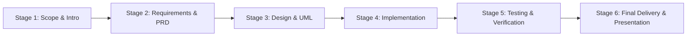
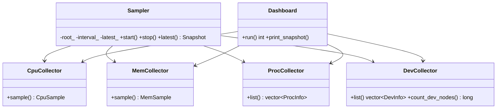

# Vitalscope — A C++ Linux System Monitor & Device Explorer

[](https://en.cppreference.com/w/cpp/17)
[]()
[](LICENSE)

Vitalscope is a modern, dependency-free Linux system monitoring and device exploration tool written in C++17. It answers one fundamental question end-to-end: **how does the Linux kernel publish hardware and system state to ordinary userspace programs, and how does a C++ application turn that raw text into trustworthy numbers?**

It reads the kernel's own information interfaces — `/proc` (CPU counters, memory zones, per-process records), `/sys/class` (the device tree drivers publish) and `/dev` (device nodes) — and presents them as a clean console dashboard. No root privileges, no third-party libraries, no kernel code: just careful parsing, an asynchronous sampler thread, and polite signal handling.

---

## 1. Professional Software Development Process (Stage 1 → Stage 6)

Vitalscope demonstrates a complete professional software engineering process—from initial scope formulation and requirement specifications to architectural design, modular prototyping, fixture-based testing, and final project delivery.



### Stage-by-Stage Lifecycle & Deliverables

| Stage Tag | Lifecycle Phase | Deliverables & Artifacts | Evidence & Documentation |
|---|---|---|---|
| `stage-1` | **Scope & Problem Definition** | System scope, training topic coverage, outcomes | [`docs/PROJECT_INTRO.md`](docs/PROJECT_INTRO.md) |
| `stage-2` | **Requirements & PRD** | Functional & non-functional specifications | [`docs/PRD.md`](docs/PRD.md) |
| `stage-3` | **Architecture & UML** | System design, class/sequence diagrams, public APIs | [`docs/DESIGN.md`](docs/DESIGN.md) |
| `stage-4` | **Implementation & Prototype** | Collectors (`Cpu`, `Mem`, `Proc`, `Dev`), `Sampler` thread | [`src/`](src/), [`include/vitalscope/`](include/vitalscope/) |
| `stage-5` | **Testing & Verification** | Unit tests, test fixture tree, shell integration script | [`tests/`](tests/), [`docs/DEVLOG.md`](docs/DEVLOG.md) |
| `stage-6` / `v1.0` | **Final Delivery & Presentation** | Project report, demo script, viva Q&A defense guide | [`docs/FINAL_REPORT.md`](docs/FINAL_REPORT.md), [`docs/PRESENTATION.md`](docs/PRESENTATION.md) |

---

## 2. Features at a Glance

| Feature | Source Interface | Description |
|---|---|---|
| **CPU Usage & Load** | `/proc/stat`, `/proc/loadavg` | Usage % over sample window, 1/5/15-min load averages |
| **Memory Metrics** | `/proc/meminfo` | Total, used, available, cached memory, usage % |
| **Process Explorer** | `/proc/<pid>/comm`, `/proc/<pid>/stat` | PID, executable name, state (sorted by PID) |
| **Device Tree** | `/sys/class/*`, `/dev` | Subsystem → device enumeration, device node count |
| **Interactive Menu** | Terminal CLI | Pick any health section on demand |
| **One-Shot Snapshot** | `--once` | Single snapshot output (script & CI friendly) |
| **Live Sampler Thread** | `--live <secs>` | Background sampler thread with periodic stdout updates |
| **Deterministic Testing** | `--root <path>` | Redirects root filesystem to saved fixtures |
| **Clean Shutdown** | `SIGINT` / `SIGTERM` | Thread safely joined, exit code 0 |

---

## 3. Architecture & Data Flow

Data flows in a single direction: kernel pseudo-files are parsed into C++ value structs, bundled into immutable snapshots, and safely rendered by presentation components.

```
/proc, /sys, /dev  →  fs_util  →  Collectors  →  Snapshot Struct  →  Dashboard / Sampler
   (kernel)          (read)      (parse)        (C++ types)        (presentation)
```

### Class Hierarchy


---

## 4. Build, Run & Demonstration

### Prerequisites
- Linux or WSL (Ubuntu 20.04+ recommended)
- `g++` compiler supporting C++17
- `make` utility

### Quick Start & Automated Verification
```bash
# 1. Clone repository
git clone https://github.com/rudraprakashnayak/Vitalscope.git
cd Vitalscope

# 2. Build application and execute test suite
make && make test
```

### Running System Demonstration Modes
```bash
# Interactive menu mode
./build/vitalscope

# One-shot snapshot mode
./build/vitalscope --once

# Live background sampler (e.g. 10 seconds, 2s interval)
./build/vitalscope --live 10 --interval 2

# Reproducible test snapshot using saved fixtures (no Linux kernel required)
./build/vitalscope --root tests/fixtures --once
```

---

## 5. Sample Outputs

### Interactive Console Dashboard
```text
== vitalscope ==
 1) CPU & load
 2) Memory
 3) Processes
 4) Devices
 5) Full snapshot
 0) Quit
choice:
```

### One-Shot Snapshot Output (`./build/vitalscope --root tests/fixtures --once`)
```text
-- CPU & load --
  user=100 system=50 idle=800 iowait=0
  usage over sample window: 0.0 %
  load average: 0.5 0.6 0.6
-- Memory --
  total=1000 kB  used=600 kB  available=400 kB  cached=150 kB
  usage: 60.0 %
-- Processes (2) --
  pid=     7  state=S  sleep
  pid=    42  state=R  gcc
-- Devices (3 in /sys/class) --
  block        sda
  net          eth0
  thermal      thermal_zone0
  device nodes in /dev: 2
```

---

## 6. Training Topic Coverage

| Core Topic | Where It Appears in Vitalscope |
|---|---|
| **Linux OS Interfaces** | `procfs` and `sysfs` navigation, `/proc` PID parsing, POSIX signals |
| **Computer Architecture** | CPU time state counters, memory hierarchy calculations, load averages |
| **Hardware & Software** | Hardware device discovery via `/sys/class` and character/block nodes in `/dev` |
| **System Programming** | Asynchronous sampler thread (`std::thread`), mutex synchronization, file I/O |
| **Modern C++17** | RAII resource management, STL containers, exceptions, string parsing |

---

## 7. License

Distributed under the MIT License. See [`LICENSE`](LICENSE) for details.

